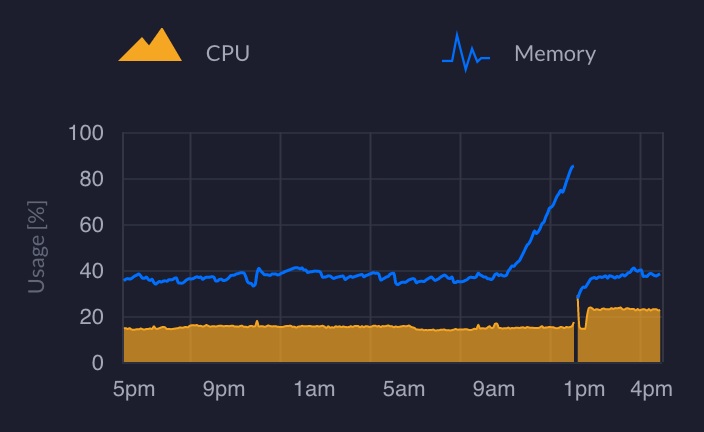

UDM-Pro Memory Monitor
======================

Patrick Wagstrom &lt;patrick@wagstrom.net&gt;

April 2021

Overview
--------

This is a really simple script that was developed for one purpose, to periodically check the amount of free memory left on my UDM-Pro and restart unifi-os if it's getting out of control.

Why would I need this? Well, one or more of the apps has a memory leak, which makes it so sometimes my system performance looks like this:



When this happens my whole network goes down for a few minutes as the UDM-Pro has to reboot. Maybe there's some switching that can happen for things that already have resolved ARP for local connections, but nothing else. Work meetings stop. And that's just not acceptable.

This "fixes" the problem by logging into the UDM Pro on a regular basis and restarting the services if memory is below a given threshold.

Usage
-----

This program supports three different types of authentication over SSH:

* username/password (least secure)
* SSH key
* `ssh-agent`

In all three cases, you must have the host key for your UDM-Pro already in your `~/.ssh/known_hosts` file - this can be accomplished by SSHing into your UDM-Pro manually once before running the program.

Command Line Arguments
======================

* `-agent`: Use a running instance of `ssh-agent` for authentication.
* `-daemon`: Keeps the program running with a timeout loop between executions. Yes, I know that strictly speaking this isn't running the program as a daemon. This defaults to false.
* `-delay <SECONDS>`: Number of time, in seconds, to wait between SSH commands when running daemon mode. This defaults to `600` seconds.
* `-host <HOSTNAME OR IP>`: The hostname or IP address of your UDM-Pro. This defaults to `192.168.1.1`.
* `-keyfile <FILENAME>`: If you're using an SSH key to authenticate, this is the location of that key file on your local filesystem.
* `-keypass <PASSPHRASE>`: If applicable, the passphrase needed to unlock your SSH key. This is only used with the `-keyfile` authentication. Not needed if your key doesn't have a passphrase associated with it.
* `-memavailable <KILOBYTES>`: the minimum amount of available memory needed on your UDM-Pro to initiate a restart of unifi-os. This defaults to `200000`. If this is set too high, you'll be restarting too often. If it is set too low, you'll end up running out of memory.
* `-password <PASSWORD>`: Although this is not preferred, the application allows you connect with a username/password combination. Note, if you use this option, your SSH password will likely be visible in local logs, command line history, etc. Setting this option forces authentication to username/password.
* `-user <USERNAME>`: The username to use to connect to the UDM-Pro. This defaults to `root` and is only used if `-password` is set.

Example Usage
=============

### SSH Key with Passphrase

```bash
/udm-pro-memory-monitor -keyfile ~/.ssh/id_rsa -keypass "swordfish"
```

### Username/Password on a different Hostname

```bash
./udm-pro-memory-monitor -password "SECRET_unifi_ROOT_password" -host 10.10.1.1
```

### Using SSH Agent and Daemon Mode with a 5 Minute Delay and Minimum of 512MiB of Remaining RAM

```bash
./udm-pro-memory-monitor -agent -memavailable 524288 -daemon -delay 300
```
License
-------

MIT License
